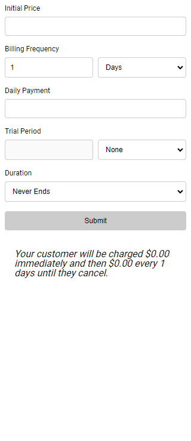

# React Hook Form + Zod <!-- omit in toc -->

Example of a subscription form with React Hook Form and Zod.


[](https://opensource.org/licenses/MIT)

<p align="center" >
    
</p>

## Summary <!-- omit in toc -->

- [Technologies Used](#technologies-used)
- [Local Configuration](#local-configuration)
- [Possible Improvements](#possible-improvements)
- [Authors](#authors)
- [License](#license)

## Technologies Used

- [HTML](https://developer.mozilla.org/en-US/docs/Web/HTML) & [CSS](https://developer.mozilla.org/en-US/docs/Web/CSS)
- [Javascript](https://developer.mozilla.org/en-US/docs/Web/JavaScript)
- [React](https://react.dev/)
- [Vite](https://vitejs.dev/)
- [NPM](https://www.npmjs.com/)
- [Github Actions](https://docs.github.com/en/actions) for CI/CD

## Local Configuration

After cloning the project, enter in the project root and run the following command:

```sh
$ npm run setup
```

- By default the application will be started at port 3000.
- You can also see the application in production [clicking here](https://react-hook-form-zod.surge.sh/).

## Possible Improvements

A system is never perfect and there is always room for improvement. Here are some points that I would like to enhance if I had more time:

- Implement tests.

## Authors

|  |
| :----------------------------------------------------------------------------: |
|               [Phillipe Martins](https://github.com/inkasadev/)                |

See also the list of
[contributors](https://github.com/inkasadev/studioled/contributors) who
participated in this project.

## License

This project is licensed under the MIT License - see the
[LICENSE.md](LICENSE.md) file for details